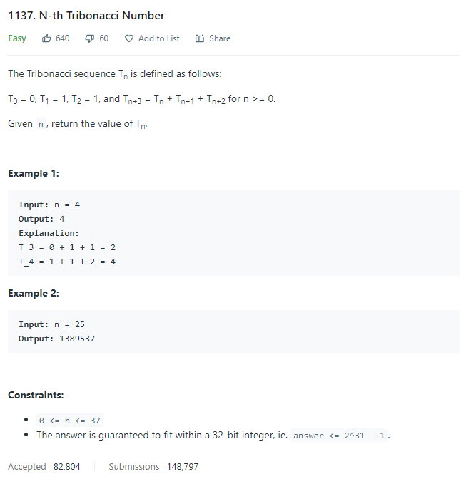
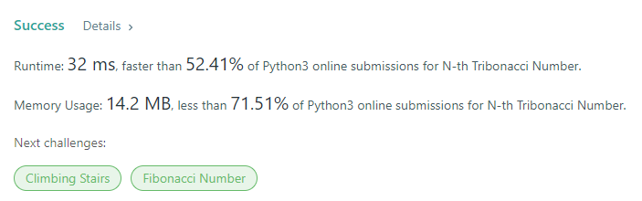
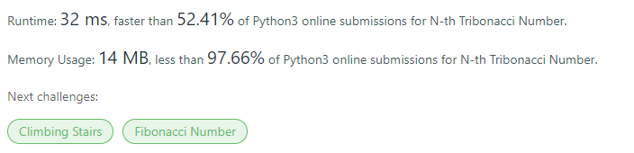

# Description:



The above image description regarded to this challege was taked from

[leetcode: https://leetcode.com/problems/n-th-tribonacci-number/](https://leetcode.com/problems/n-th-tribonacci-number/submissions/)

## Analysis:

Here, the first brute force approach is just use a recursive function to implement
tribonacci definition as follow:

```
class Solution:
    def tribonacci(self, n: int) -> int:
        if n == 0:
            return 0
        if n == 1 or n == 2:
            return 1
        return self.tribonacci(n-1) + self.tribonacci(n-2) + self.tribonacci(n-3)
```

In that case this algorithm , is too slow because apply several times the same calculus (draw their tree),
even though this is good first step because, now we can avoid redundant evaluations using a dictionary to
get each value only once time.

In addition we can improve the memory use, avoiding the recursion, so we can use a loop to calculate from
last nth term until n required term.

## Final Result

### Dictionary + Recursion (check memory use):



### Dictionary + Recursion (check memory use):



**Related topics**: Recursion, fibonacci
