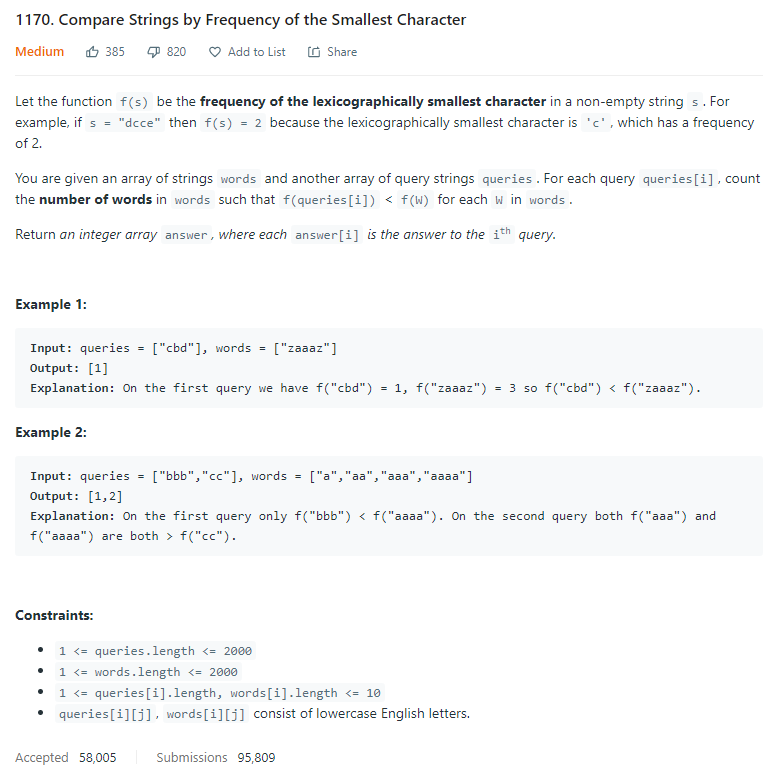
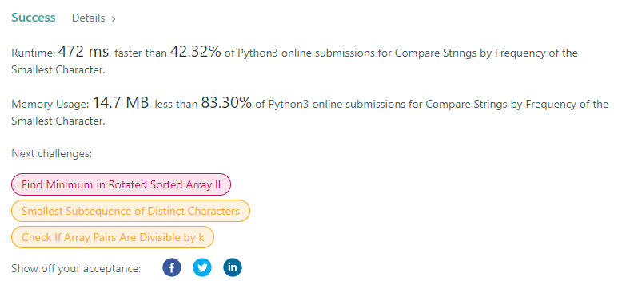

# Description:

The above image description regarded to this challege was taked from

[Leetcode:1170. Compare Strings by Frequency of the Smallest Character](https://leetcode.com/problems/compare-strings-by-frequency-of-the-smallest-character/)

## Analysis:

Here, I can apply first stages for conting sort, so the ascii code will be the key
and for both array (queries and words) we will count total apparicions for each letter

Second step, apply counting sort again but just with f(w) array

Finally total elements where f(queries[i]) < f(W) = counting_words[last_position] - counting_words[i]

This approach can improve, but now is enough because max(len(words)) == max(len(queries)) == 2000
and max(queries[i]) == max(words[i]) == 10, little n elements, will work fine with this algorithm.

Space: To avoid increase the space I will recycle the ascii array for each word in both arrays.

### Cornercases:

- len(queries)>len(words)
- f(W) always greater than f(qureries[i])

### Extra cases to test:

- ["bb"], ["zaz"]
- ["d","dd","ddd","dddd"],["bbb","cc"]

## Final Result

**Related topics**: counter sort, sorting, string
