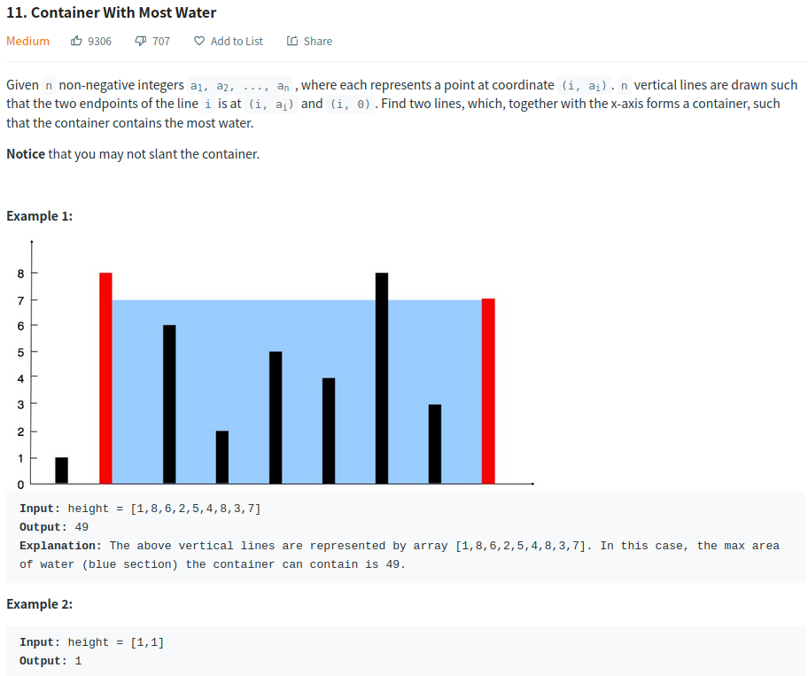
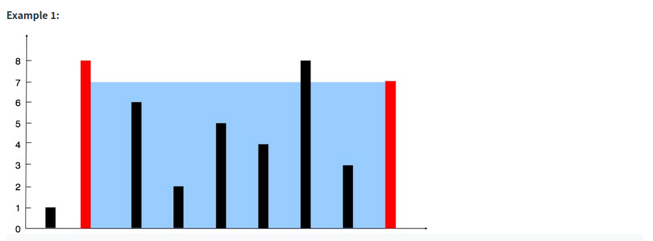
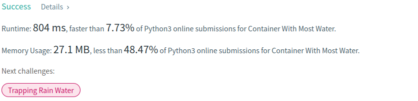

# Description:



The above image description regarded to this challege was taked from [leetcode.com:11. Container With Most Water](https://leetcode.com/problems/container-with-most-water/)

## Analysis:

**base** = end_vertical_index - start_vertical_index

**start_height** = height [start_vertical_index]
**end_height** = height [end_vertical_index]

From description, we can see that the total water container will be related to the following equation:

**water_container** = **min** (start_height, end_height) \* base

To analyze this challenge, we can use a couple examples:

**Example 1**:

```
start_vertical_index = 0
end_vertical_index = 50
start_height = 1
end_height = 50

then :

base = 50 - 0
water * container = min(start_height, end_height) * base
= min(1,50) * (50) = 50

We can notice that the shorter vertical meassure affect the final result, reducing the final
water capacity.
```

**Example 2**:

```
start_vertical_index = 0
end_vertical_index = 6
start_height = 10
end_height = 15

base = 6 - 0
water*container = min (start_height, end_height) * base
= min (10,15) * (6) = 60
```

We can notice that a shorter distance between the first and last vertical lines do not necessarily generate a bad water capacity.

Here, we will use two pointers to get the start and end lines, so we will use just one loop.


Image's original source [leetcode.com](https://leetcode.com/problems/container-with-most-water/)

If we checked the example image inside the challenge, we can notice the following elements:

- Height starts with 0 position and ends with 8th position
- Setting start_vertical_index = 0 and end_vertical_index = 8 we will have the following result:

```
  start_vertical_index = 0
  end_vertical_index = 8
  start_height = 1
  end_height = 7

  base = 8 - 0
  water*container = min (start_height, end_height) * base
  = min (1,7)\* (6) = 42
```

From here, we can see that to move one pointer, an option is move the pointer with shorter vertical height because we will reduce the base then a way to compense that is trying to check a higert line.

### Cornercases:

- height.length is even
- height.length is odd
- height.length == 2
- max (height) == min (height) => all elements in height are equal

## Approach:

- If max (height) == min (height) use base = height.length - 1 and return
- Use a max capacity variable to store max capacity meassured.
- Use a star pointer starting in 0
- Use an end pointer starting in height.length-1
- While start pointer < end pointer get the water capacity
- Update max capacity if current capacity is greater
- If height [start pointer]<= height [end pointer] increase start pointer
- If height [start pointer] > height [end pointer] increase end pointer

## Final Result



**Related topics**: Two pointers technique
