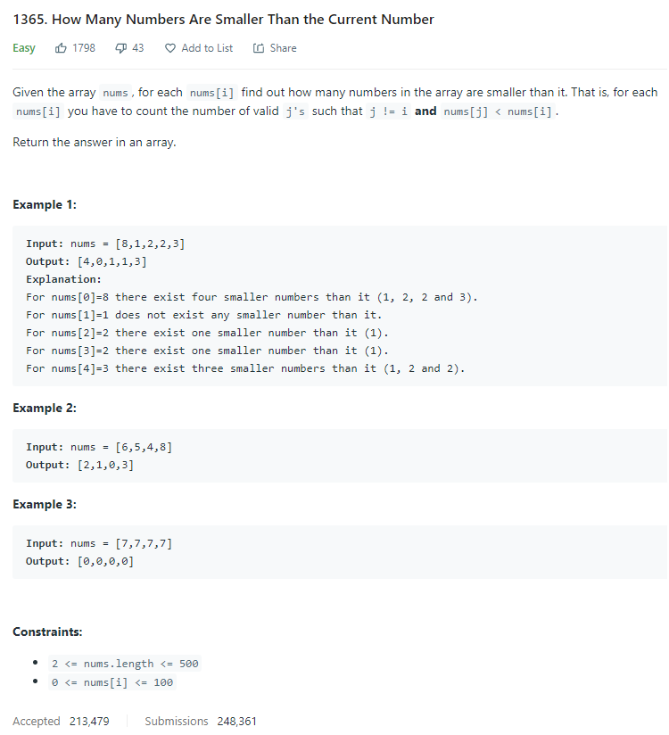

# Description:

The above image description regarded to this challege was taked from

[Leetcode: 1365. How Many Numbers Are Smaller Than the Current Number](https://leetcode.com/problems/how-many-numbers-are-smaller-than-the-current-number/)

## Analysis:

The first part of counting sort algorithm can be useful in this case.

complexity: o(n)
space:o(101) (space required for counting array)

I will count each number using an array with 101 positions (0-100) and
each position will be the "key" to count how many times is each number inside the original array, and I will save that total using a counter array.

After, we will visit each counter array position and I will count how many numbers
where visited before each position as follow:
counter[i] = counter[i]+counter[i-1]

Finally, each position inside counter array will contain the total numberslees or equal
for each key, so to know how many smaller elements exist for some key, we can use the
counter [key-1] position.

### Cornercases:

0 element can generate errors with counter[element-1]
all elements are equal, so the total elemenst smaller than some array[i] is 0 for each i

### Extra cases to test:

0
7, 7, 7

## Final Result

**Related topics**: sorting, arrays, counting sort.
