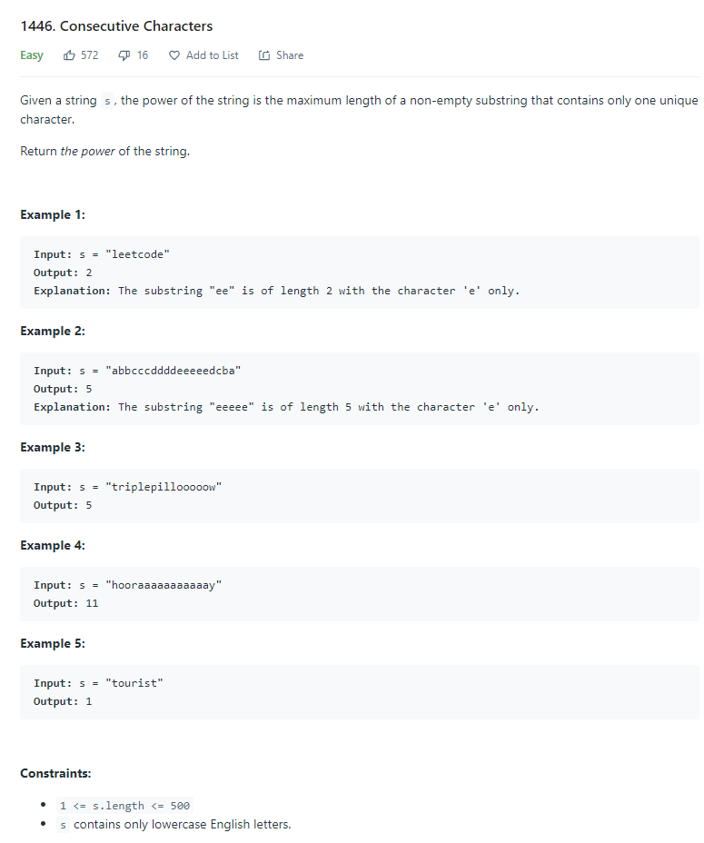

# Description:

The above image description regarded to this challege was taked from

[leetcode:1446. Consecutive Characters](https://leetcode.com/problems/consecutive-characters/)

## Analysis:

Here, a brute force approach, will use a dictionary and after a max heap to extract the max repetition value, in this approach has O(n) time complexity and O(n+k) space complexity where n is len(string) and k is
the len(max_heap).

The second approach is to avoid the heap use, applying a local variable to save the maximum global, in this case
the time complexity is the same, but space complexity is O(n).

Finally a better approach, is only use a local maximum to calculate the "current" letter maximum consecutive occurrences, so in this case, we can avoid the dictionary, with a final space complexity O(1)

### Cornercases:

- Only one character
- Same character has more tha once consecutive occurrences (e.g aabaaab or aaabaaba)

### Extra cases to test:

b
bb
aaaabbaaabbaa
aabbaaaabaaaaaabaa

## Final Result

**Related topics**: Two pointers, dictionary, heap
