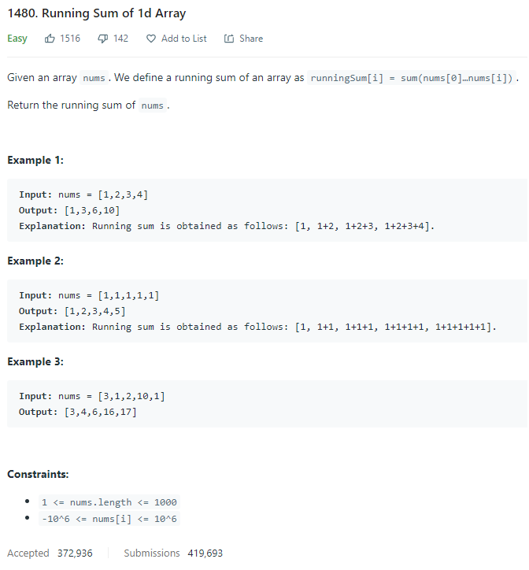
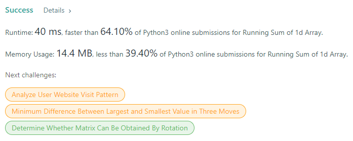

# Description:

The above image description regarded to this challege was taked from

[leetcode:1480. Running Sum of 1d Array](https://leetcode.com/problems/running-sum-of-1d-array/)

## Analysis:

Here, is posible get the total value in each positition as follow:

array[index]=array[index]+array[index-1]

Notice that in this case we need start index in 1 instead 0.

**Related topics**: Arrays.
