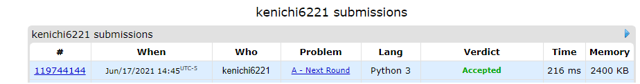

# Description:

The above image description regarded to this challege was taked from

[Codforces:158 A. mext round](https://codeforces.com/problemset/problem/158/A)

## Analysis:

In this case is possible to count how many people pass to the next round and take the last approved
rating minwhile we check each rating in the ratings array as follow:

- Minimum rating to pass will be 1 until total approved == k
- Minimum rating == ratings[last_approved_position]
- if ratings[current_pos]>=minimum rating, we will increase the approved count by 1.

## Final Result

**Related topics**:
