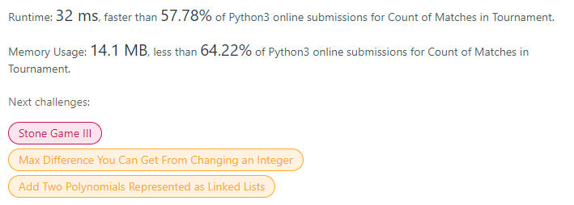
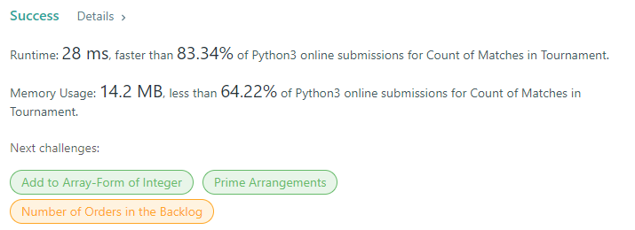

# Description:

The above image description regarded to this challege was taked from

[leetcode:1688. Count of Matches in Tournament](https://leetcode.com/problems/count-of-matches-in-tournament/)

## Analysis:

Here, the short aproach is using recursion and use n == 1 as base case, so in this case our constraints includes
n<=200 then almost all time complexity will work.

An extra approach, is avoid the recursion and use a while loop
applying the main operations until n==1, in this case we will
decrease space complexity to O(1) because without recursion, the recursion stak will desapear.

## Final Result

## Recursion approach:

## While loop approach:

**Related topics**: Recursion.
