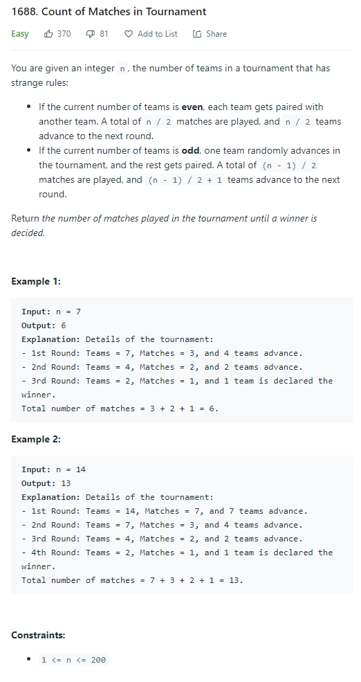

# Description:

The above image description regarded to this challege was taked from

[leetcode:1688. Count of Matches in Tournament](https://leetcode.com/problems/count-of-matches-in-tournament/)

## Analysis:

Here, the short aproach is using recursion and use n == 1 as base case, so in this case our constraints includes
n<=200 then almost all time complexity will work.

## Final Result

**Related topics**: Recursion.
