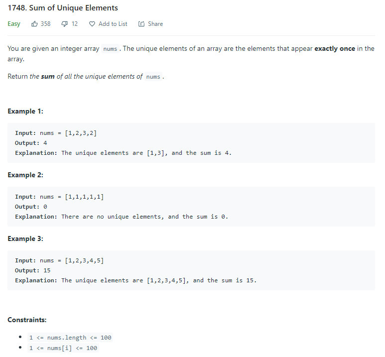

# Description:

The above image description regarded to this challege was taked from

[Leetcode: 1748. Sum of Unique Elements](https://leetcode.com/problems/sum-of-unique-elements/)

## Analysis:

First, approach use a dictionary to save all elements, counting the total times that each element is in the
original array, after we can use an extra loop to totalize only numbers that appears exactly once in the original
array.

Time complexity O(2n) => O(n)

Improving the approach we can use, only one loop to check if some value already was visited as follow:

- If number already was visited:
  total - dictionary[number]
  dictionary[number] = 0

- If is a new number we can added it to the total
  total = total + number
  dictionary[number] = number

This approach only requires one loop so is a short improve but works fine.

Finally, we can notice that all numbers are between 1 an 100, so
we can use an array, as concecuence the time complexity for lookup, insert and update becomes in O(1).

## Final Result

### Dictionary approach:

### Array approach:

**Related topics**: Array, Dictionary
