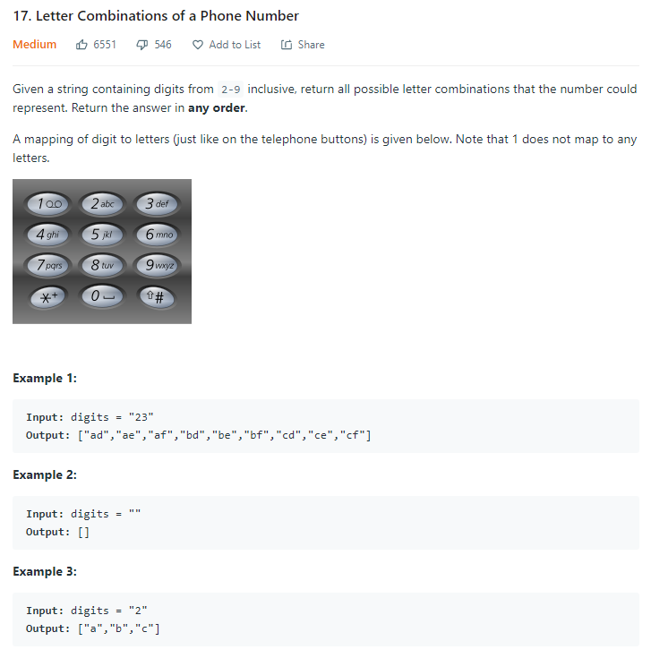

# Description:

The above image description regarded to this challege was taked from

[leetcode:17. Letter Combinations of a Phone Number](https://leetcode.com/problems/letter-combinations-of-a-phone-number/)

## Analysis:

Here, I will use the backtracking technique with the following elements:

- Base case: Len(digits)== len(formed_string), so the formed string until know includes a letter for each original digit
- Candidates: Letters in each dial number
- Process_solution: Add the formed string to final array solution

### Performance aid:

- Using a dictionary [number,[letters]] I can get an array with letters for each number with time complexity O(1)
- Including the empty string inside the above dictionary, is possible return dictionary_dials[digits] with time complexity O(1) if len(digits)<2

## Final Result

**Related topics**: Backtracking
