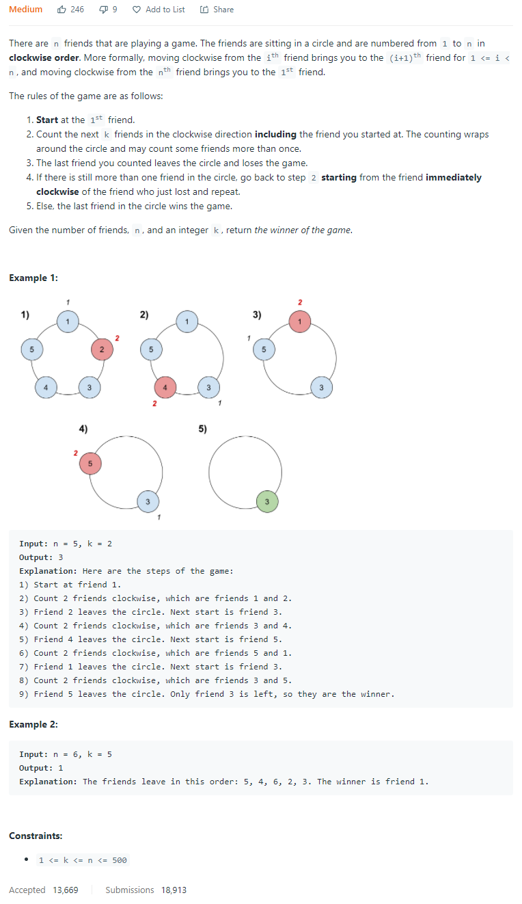
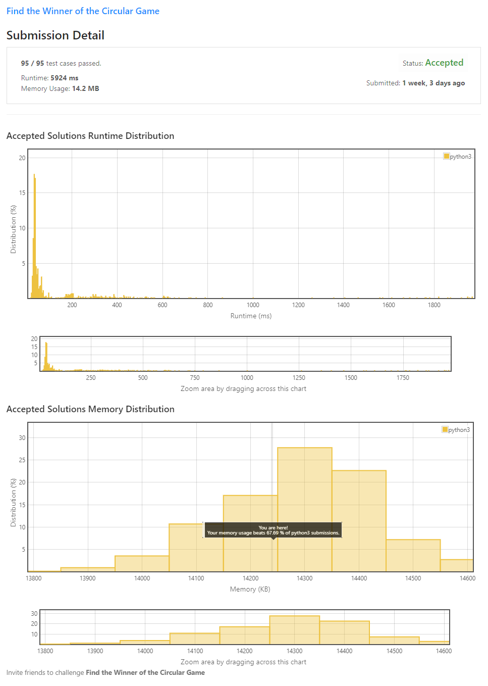
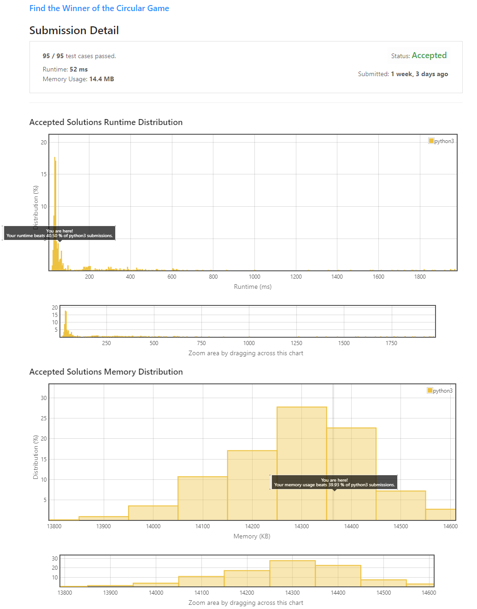
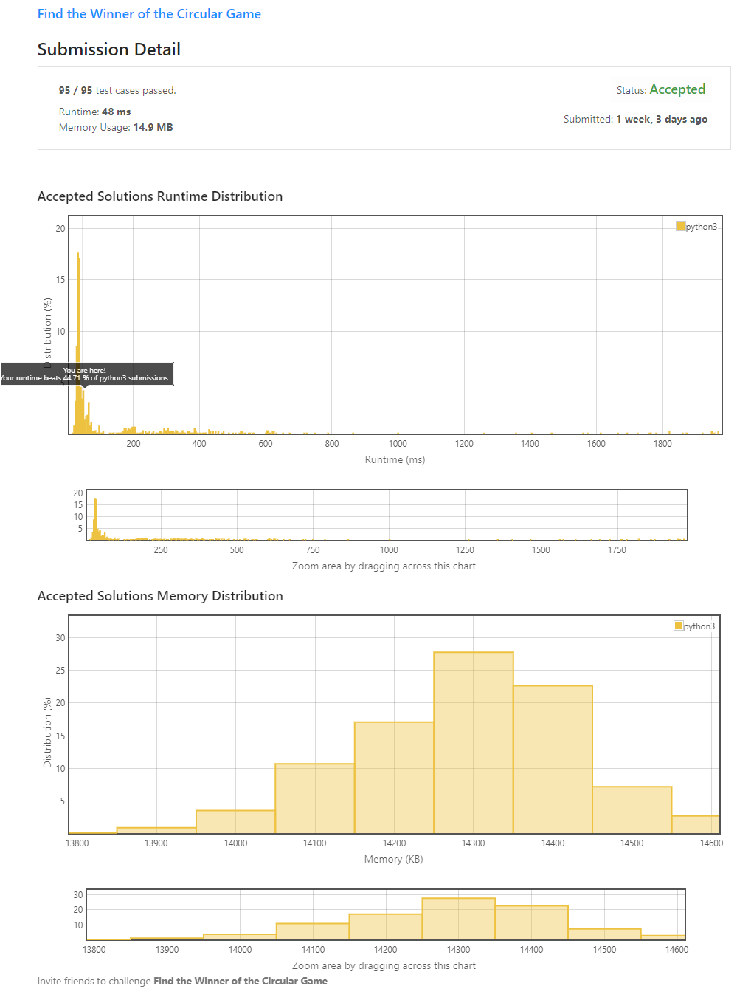

# Description:

The above image description regarded to this challege was taked from

[Leetcode: 1823. Find the Winner of the Circular Game](https://leetcode.com/problems/find-the-winner-of-the-circular-game/)

## Analysis:

## Final Result

### List approach:

### code improving:

### Josefus algorithm (without list)

**Related topics**: Josephus algorithm, arrays
