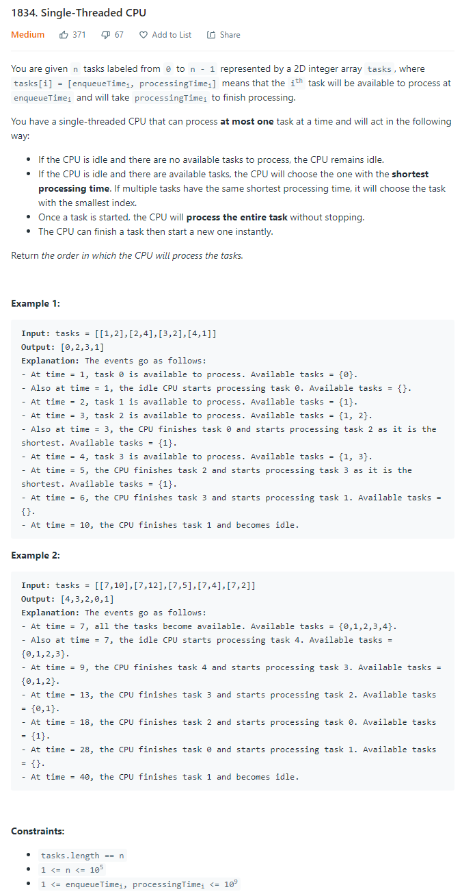
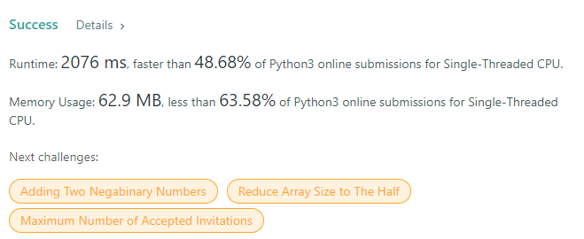

# Description:

The above image description regarded to this challege was taked from

[Leetcode: 1834. Single-Threaded CPU](https://leetcode.com/problems/single-threaded-cpu/)

## Analysis:

Here, the first approach is the use of two heaps, as follow:

- Firs heap will be a min-heap (heap_enqueueTimei from here), I will save all tasks there and the first task here will be the first task to run
- The second heap will be a min-heap (processingTimei from here) too, but in this case, I will use the processing time property
- Both heaps, will have a set element (property_to_heap, index)
- After fill out the first heap, I will extract the next n-element where totaltime>= heap_enqueueTimei[0][0]
- Each extracted element from the heap_enqueueTimei will be pushed in heap_processingTimei as (processingTimei, index)
- I will apply heappop in heap_processingTimei to extract the next process to run and totalize the time

Important:

- After run first task, I will add only the processingTimei because the enqueTime has already been passed before run the next task

### Corner cases:

- case 1 : Smalll enqueueTime with the bigger processingTime
- case 2 : All task have the same values
- case 3 : Totaltime until some poins is smaller than next heap_enqueueTime

### Extra cases:

- case 1: [[7,3],[7,3],[7,3],[8,2],[9,1]]
- case 2: [[7,3],[7,3],[7,3]]
- case 3: [[5,2],[7,2],[1,1]]

### Final notes:

A distict approach to explore is apply a sorting over the task array.

## Final Result

**Related topics**: heap
