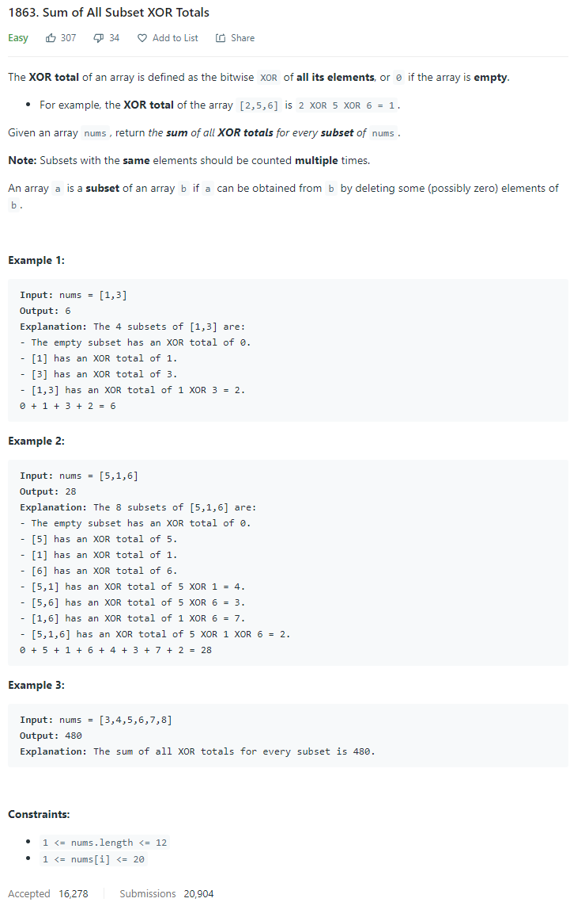
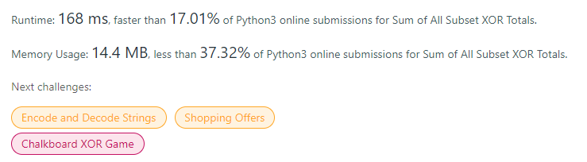
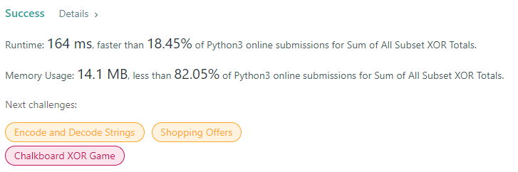

# Description:

The above image description regarded to this challege was taked from

[leetcode:1863. Sum of All Subset XOR Totals](https://leetcode.com/problems/sum-of-all-subset-xor-totals/)

## Aproach I: backtracking

Here, I will use a backtracking approach as follow:

- Stop: Kth element evaluated (added or not) == len(original_subset)
- Possible decisions each iteration: [include_kth, not_include_kth]

When I had created a new subset

- if len(subset) > 0 :
  - Apply XOR with each element
  - Add totalized element to totalized_array in position 0

After above operations: result = totalized_array[0]

## Aproach II: [Powersets](https://en.wikipedia.org/wiki/Power_set)

Here, I will use binaries to validate if one element will be included or not inside the new subset, so 1 mean includes the kth element and 0 mean exclude that element.

In addition, total subsets will be 2^n where n = (len(nums)), so its possible use a loop from 0 to 2^n - 1 and I will use each element in this count in its binary version.

**Important to remember:**

- if num & ( 1 << K-1 ) > 0 : kth bit is on

## Final Result

### Bactracking approach:

### Powerset approach:

**Related topics**: backtracking, [Powersets](https://en.wikipedia.org/wiki/Power_set)
