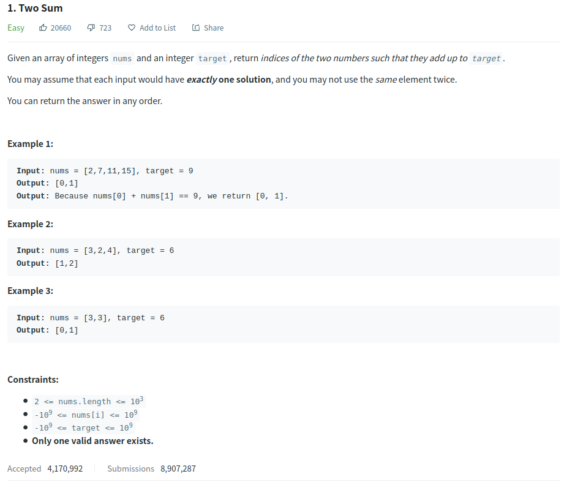

# Description:



The above image description regarded to this challege was taked from

[leetcode:1. Two Sum](https://leetcode.com/problems/two-sum/)

## Analysis:

Here, we can use a Two Pointer technique, but the original order matters, so we will apply the Two Pointer technique using the following steps:

- We will create a dictionary with <target - currentElement, currentElementPosition>
- We will set the start pointer at first array's
- We will set the final pointer on the last array's position

In fact, we do not know if the required element is in the array until we visit the position, then we can visit
two positions each time (start and end) and apply the next idea:

**required_number_to_resolve_the_sume** = target - array [current_position]

```
if the dictionary contains required_number_to_resolve_the_sume:
  storedIndex = dictionary [required_number_to_resolve_the_sume]
  return [current_position, storedIndex]
else:
dictionary [required_number_to_resolve_the_sume, current_position]
```

As you can see, we are storing the required number to complete the target sum, with the current visited index, then if we found the required number we can get the visited index.

Notice that the original description in this problem contains the follow clarification: "You may assume that each input would have exactly one solution, and you may not use the same element twice."

In other cases (without above clarification), we would check if start == end and in that case does not exits any solution and that would be a good corner case to test.

### Cornercases:

- Several repeated numbers array:

  - [3,3,3,3,3,2,7] target = 9
  - [2,2,2,2,2,2,7] target = 9
    In this case the problem's description says that we will have **_"exactly one solution"_** then this case
    will not happen never.

- The bigger number is negative but target number is positive

  - [-2,-3,-7,-15,-15,-15,-15,-15] target = 4
    In this case the problem's description says that we will have **_"exactly one solution"_** then this case
    will not happen never.

- The smaller number is bigger than the target number

  - [15,16,17] target = 9
    In this case the problem's description says that we will have **_"exactly one solution"_** then this case
    will not happen never.

- The array's size is 2

  - [3,3] target 6
    In this case the problem's description says that we will have **_"exactly one solution"_** if len (array), already we have the solution [0,1].

  As you can see all the border cases analysed were solved inside the problem descriptions, but is a good exersice
  think about these cases to ask for clafications if it is necessary.

Testing with these extra cases, we can notice that we will have inputs with at less and only one correct answer.


### Extra cases to test:

## Approach:

- Use a dictionary to store pending numbers to visit, and index solution.
- Use two pointers' technique to check two numbers each iteration.
- If the current index belongs to the dictionary, returns current index and stored index.

## Final Result


**Related topics**: Two pointers technique
