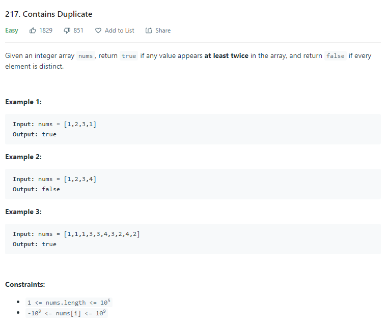
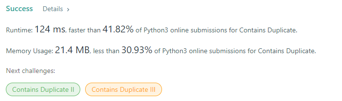
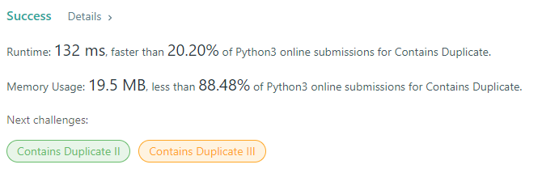

# Description:

The above image description regarded to this challege was taked from

[leetcode:217. Contains Duplicate](https://leetcode.com/problems/contains-duplicate/)

## Analysis:

Possible solutions:

brute force => nested loops => O(n^2) space:O(1)
sort and check => O(nlogn) space: depends of algorithm, quick sort O(1)
dictionary => time: O(n) space:O(n)
heap, and check=> time: O(n) space:O(1)

Here, I choose the heap and check approach, because is short in space and
short in time too.

## [Final result](https://leetcode.com/problems/contains-duplicate/submissions/)

### Dictionary approach:

### Heap and check approach

**Related topics**: heap, arrays
