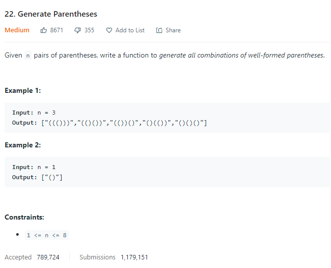
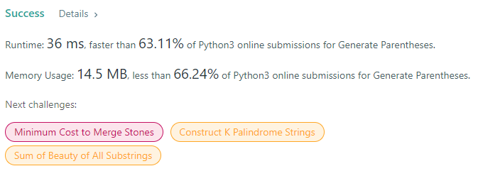

# Description:

The above image description regarded to this challege was taked from

[{challenge page}:{challenge number}. {challenge title}](challenge url)

## Analysis:

Here, the first and "pragmatic" approach is use backtracking as follow:

- Candidates: array with n open parentheses "(" and n close parentheses ")"
- Options: [Include_kth_parentheses, Skip_kth_parentheses]
- Base case: len(subset) == 2\*n
- Process candidate solution: validate if all parentheses are valid (solve this challege first can hepl you)

An extra approach, it is harder to see but avoids validate each candidate, if we use the following elements:

- Always a right subset requires n open parentheses and n close parentheses
- Always a right subset: len(parentheses) == len(close_parentheses)

On the basis of the above, it is possible to think in next base conditions and use backtracking with two variables:

- Base condition I (solution): total_open_parentheses == total_close_parentheses and open_parentheses == n
- Base case II (we will add an open parentheses): Total_open_parentheses < n (counting from 0)
- Base case III (we will add a close parentheses): Total_close_parentheses < total_open_parentheses (if are equal stop)
- Firts backtrack: Add open parentheses "(" and increase the total_open_parentheses by one
- Second backtrack: Add close ")" and increase the total_close_parentheses by one

## Final Result

**Related topics**: Backtraking
