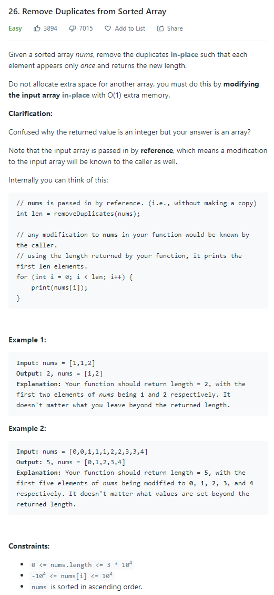
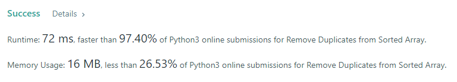

# Description:



The above image description regarded to this challege was taked from

[leetcode:26. Remove Duplicates from Sorted Array](https://leetcode.com/problems/remove-duplicates-from-sorted-array/)

## Analysis:

Here, when we explore the array we can think in two cases for each new visited number:

- Is original: any other already visited is equal
- Is duplicated: we "saw" this number before

From here, we can think in a two pointers technique as follow:

- One pointer will mark the last position until all our elements are distinct, so this position plus one will be the total unique elements.
- One pointer will explore next element to discover if the next is original, or duplicated.

We will apply next steps to move those pointers:

1: if A[original] == A[explorer]: In this case, we need continue exploring until find the next original element, then we will increase only the explorer
pointer.

2: If A[original]!=A[explorer]: Here, we will update original plus one with the explorer element, this resolve the multiple duplicate elements.

```
if A[original]!=A[explorer]:
  original+=1
  A[original] = A[explorer] # include the next original number
  explorer+=1
```

### Cornercases:

- Empty array: In this case result = 0
- len(A) == 1: In this case result = 1

## Final Result



**Related topics**: Two pointers
