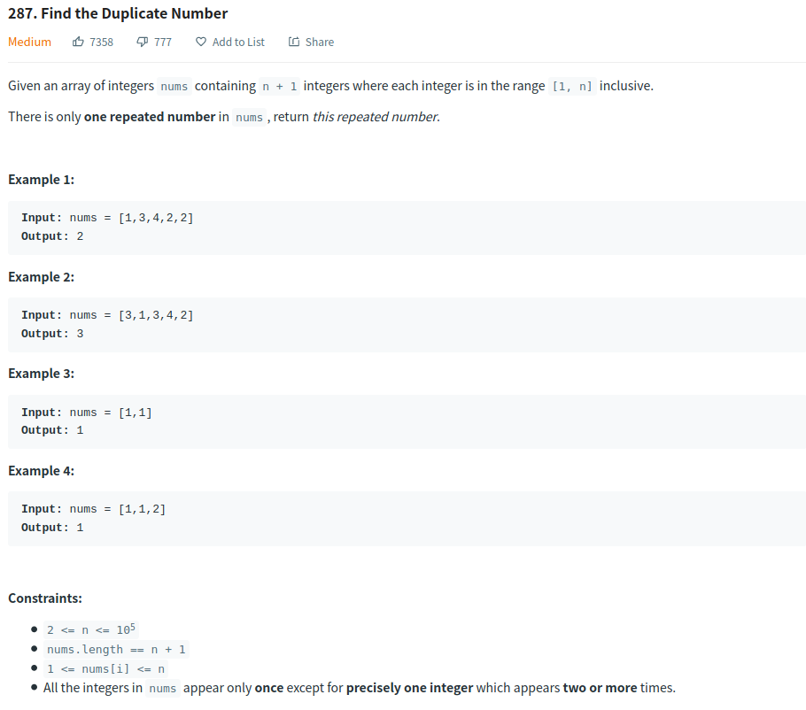
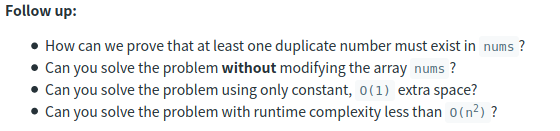
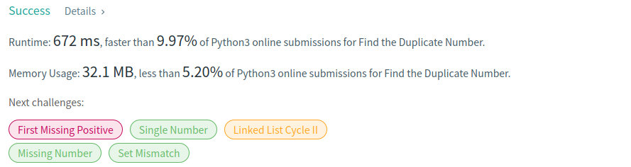
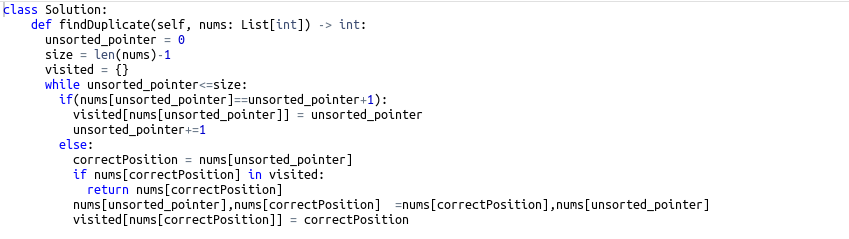
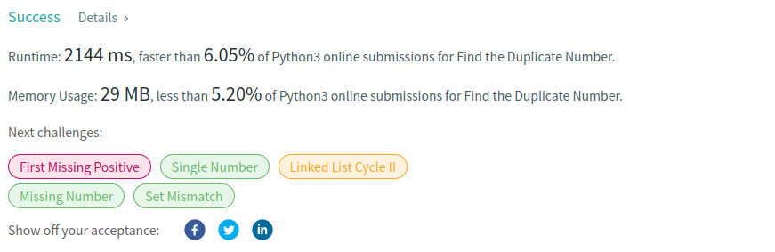
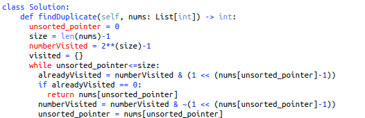

# Description:

The above images description regarded to this challege was taked from

[leetcode:287. Find the Duplicate Number](https://leetcode.com/problems/find-the-duplicate-number/)

## Analysis:

Aproach I (firt commit):
Here, is important take the next sentence in mind "All integers in nums appear only once except for precisely one integer that appears two or more times," so the repeated number is only one, then sorting the array can be useful to find the repeated number.

We will sort the array in place swapping each value position to its correct position and checking visited values with a dictionary.

**Anoter idea**:

We can use a number as a binary array and turn off bits meanwhile check each array position, if in some moment
you find a bit equal to 0 before you change it, then that is a repeated number.

### Cornercases:

- nums.length = 2
- duplicate number in last position
- duplicate number in first position
- duplicate number in middle position
- nums.length is odd
- nums.length is even
- all numbers are the same

## Approach I:

- Sort array swping in place
- Use a dictionary to save visited numbers

## Approach II:

- Use number as bit array
- Turn off bits already visited
- If we find a bit equal to 0 then this is the repeated number

## Final Result

Approach I: (this modify the original array)

Related code:

Approach II:

Related code (applying the follow up):

**Note**: current code in this folder is approach II but you can see the first approach checking the commit's id d2b4eac

**Related topics**:Array, Two pointers
