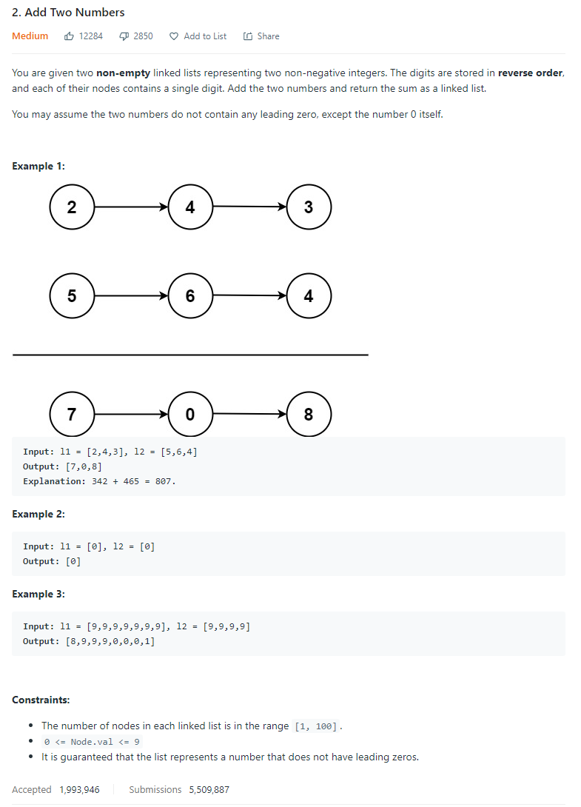
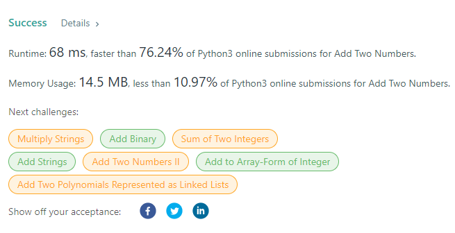

# Description:

The above image description regarded to this challege was taked from

[leetcode: 2. Add Two Numbers](https://leetcode.com/problems/add-two-numbers/)

## Analysis:

Here, we will apply the common addition rules, but from left to right, so the last carry will be
the last node if that is required.

Checking the addition process:

- When A + B > 9 we will have a carry
- Carry = (A+B)/10 (only the integer part)
- Each time the safe digit to add in total value will be (A+B)%10
- If carry > 0 for each position the candidate result will become in A+B+Carry

From the above sentences, we can go deeper and use a generalized equation to apply the sum as follows:

current_total = A + B + carry (first carry value will be 0)
carry = current_total//10
digit_to_add = current_total%10

### space:

I can get the final value without creating a total list, so in this case, I will override one original node whit the addition's result in that position.

### Corner cases:

In some cases, the total number will have more digits than each element to sum (e.g 1 + 9 = 10), so when after added all digits, carry > 0 I will add an extra node with carry value.

Will be important check cases when the first element have more digits than second, when second have more than first,
and when both of them have the same count of digits.

Here, I will store the result in l1 list, so when this list is short than l2, I will apply
l1.next = l2 and I will continue with suma only meanwhile carry > 0.

### Extra cases to test

- [9,9,9], [1] first number has more elements than second, carry will require its own node
- [1],[9,9,9] second number has more elements than first, carry will require its own node
- [9,9,9], [9,9,9] both numbers have the same count of digits, carry will require its own node
- [0],[9] both numbers have the same count of digits, final carry will be 0

## Approach:

## Final Result

**Related topics**: linked list, in place add
