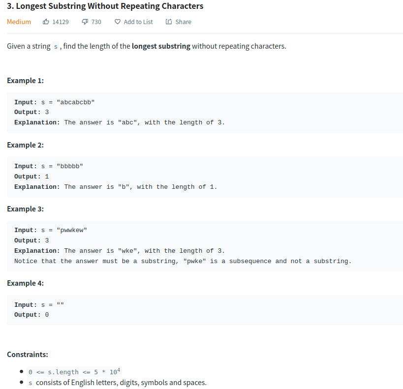

# Description:

The above image description regarded to this challege was taked from
[leetcode:3. Longest Substring Without Repeating Characters](https://leetcode.com/problems/longest-substring-without-repeating-characters/)

## Analysis:

### Cornercases

- If S is empty: in this case the output will be 0
- Upper and lower cases characters: We will assume that a!=A and both of them can be contained in s

### Extra cases to test:

- "abbbbbbbbbbba"
- "aabb"
- "abba"

## Approach:

The longest substring is a string that is contained in the string S, so we can think that the total lenght for

The longest substring without repeating characters is just the next equation result:

**Longest_substring_length** = end_sub_index – start_sub_index + 1

**Where**:

    start_sub_index = index in S where the longest substring without repeating characteres starts

    end_sub_index = index in S where the longest substring without repeating characteres ends

**Example**:

If s = "**abc**b"

Longes_expected_substring is = **abc**

Then :

Star sub index = 0

End sub index = 2

As we can notice as concecuence to start with 0 base, we need add 1 to get the final length for longest substring.

**Expected result** = 2 – 0 + 1

**Note**: In this case the expected output is a number then could be posible that we can several substrings with the same

Length and the final output will represent all of this strings.

Example:

If s = "abcbefb"

Two possible sub strings are: abc or bef or efb and all cases have the same length.

Summary:

If S is empty the output will be 0

If S is not empty output = end_index – start_index +1

To evaluate if some character already exist inside substring we will use a dictionary.

## Final Result

**Related topics**: Slide Window technique
