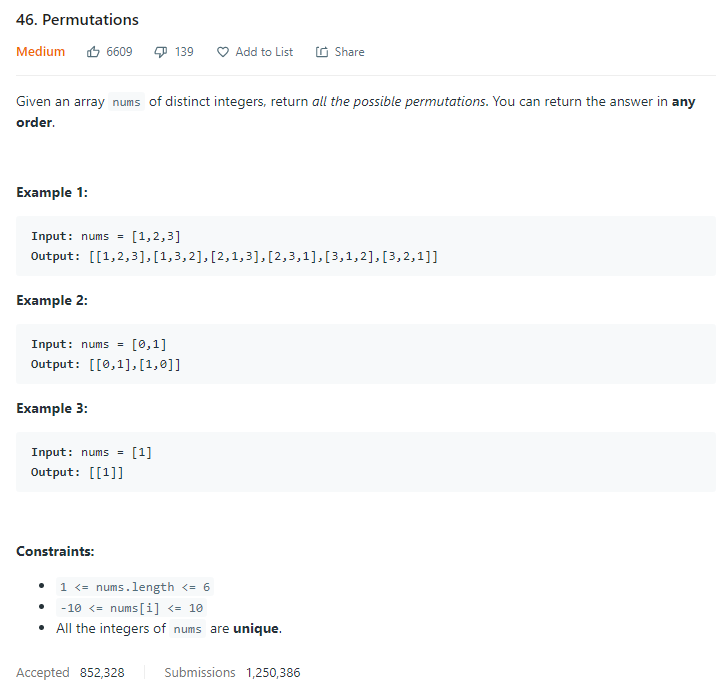
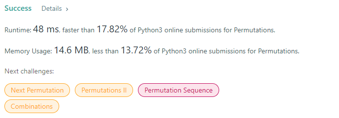

# Description:

The above image description regarded to this challege was taked from

[leetcode:46. Permutations](https://leetcode.com/problems/permutations)

## Aproach I: Backtracking

Here, I will use a backtrack approach as follow:

- Instead permute the original elements I will permute indexes
- Function to generate candidates will return indexes available to include for each permutation
- Base case: len(permuted_indexes) == len(original_array)
- For each permutation:
  - Build array with elements from permuted_indexes array
  - Add built array to global answer

### Why permute indexes instead elements directly:

- If we permute original elements I'll check if element_k is in permuted array as follow:
  ask if element_k in permuted_array

- In python order x in y has a time complexity O(n) then for each element in the worst case get candidates for a permutation can be O(n^2)
- If I use a boolean array with positions the time complexity is O(n), that applies to create candidates to permute too.

## Final Result

**Related topics**: Backtrack
