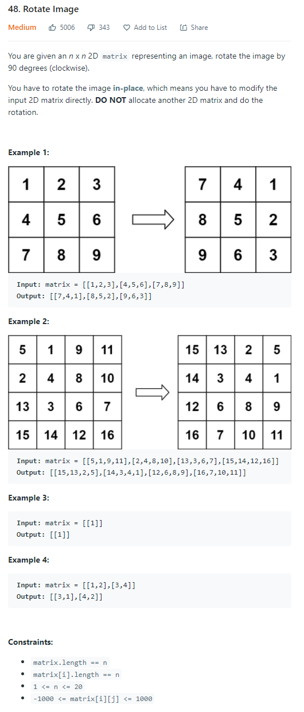

# Description:



The above image description regarded to this challege was taked from

[48. Rotate Image
](https://leetcode.com/problems/rotate-image/)

## Analysis:

After a little experimentation you can notice that in this exercise, the new position for some element will be :

```
matrix_new[0+original_column][n-1-original_row] = original_matrix[row][column]
```

Then a firs aproach will be follow the next steps:

- Create an axiliar matrix
- Map each element form original matrix to auxiliar matrix as we see above.
- Map the auxiliar to original matrix.

Here the firs aproach can not applied because we have an extra challenge: "**DO NOT** alocate anoter 2D matrix" then
we need an extra aproach:

Second approach:

We can see each element as a domino piece, then if we change some element from its original position that will cause that the next piece change its position too.

After an extra experimentation, you can notice that each movement cause at lees 4 rotations, so we can apply 4 swaps
each time an go for the nex element.

### Cornercases:

- If original matrix is nxn but n < 2 then we will return
  the oritinal matrix (rotation is not necesary)

## Final Result


**Related topics**:
