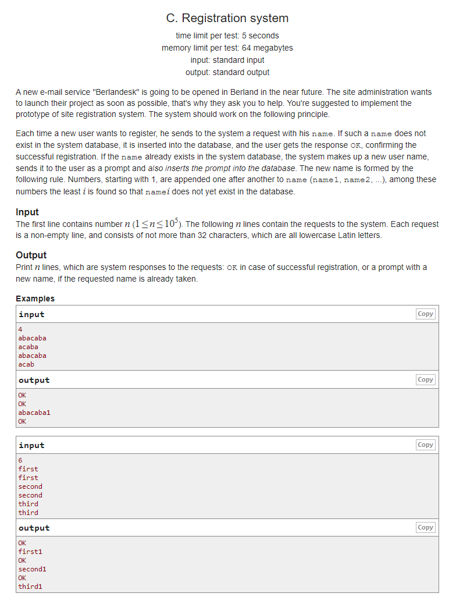
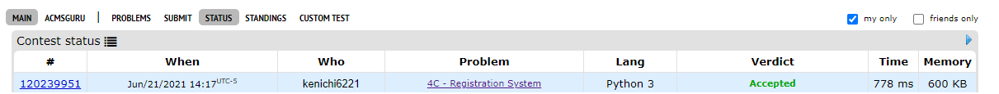

# Description:

The above image description regarded to this challege was taked from

[{codeforces:4 C. Registration system](https://codeforces.com/problemset/problem/4/C)

## Analysis:

Here, we can use a dictionary with name as key and a counter as value, other aproaches as
have a collection will as value, will use more space than we really need to resolve the
challenge.

Steps:

- if name is not already sotred: add name with key 0
- if name is stored already increase the value by one and update
- by default the response will be ok but if name already was stored change to {readed_name}+{updated_value}

## Final Result

**Related topics**: Dictionary
