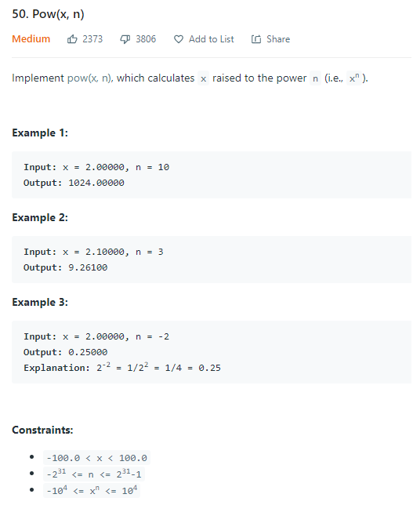

# Description:



The above image description regarded to this challege was taked from

[leetCode:50. Pow(x, n)](https://leetcode.com/problems/powx-n/)

## Analysis:

We can use some pow properties, for example:
$$(y ^ m) ^ n = y^(m * n) $$
,then we can analyze this using some examples like the folowwing:

$$
x ^ 4 = x*x*x*x = x^2 * x^2 = (x^2)^2
$$

$$
x ^ 5 = x*x*x*x+x = x^2 * x^2 * x = (x^2)^2 *x
$$

$$
x ^ 8 = x*x*x*x*x*x*x*x = x^2 * x^2 * x^2 * x^2 = (x^2)^2 * (x^2)^2 = [(x^2)^2]^2
$$

From above we can see that is possible acumulate the result if we multiply the result by
itself, but in cases when y is odd its possible have a "residual_pow", so to get the final result we will use the following ecuation:

```
result = result * pow(x,resisual_pow)
```

### Cornercases:

$$
	x^y = \begin{cases}
   1 &\text{if } y = 0 \\
   0 &\text{if } y = 1 \\
   1/ x^y &\text{if } y < 0
\end{cases}
$$

## Final Result


**Related topics**: bitwise, math
