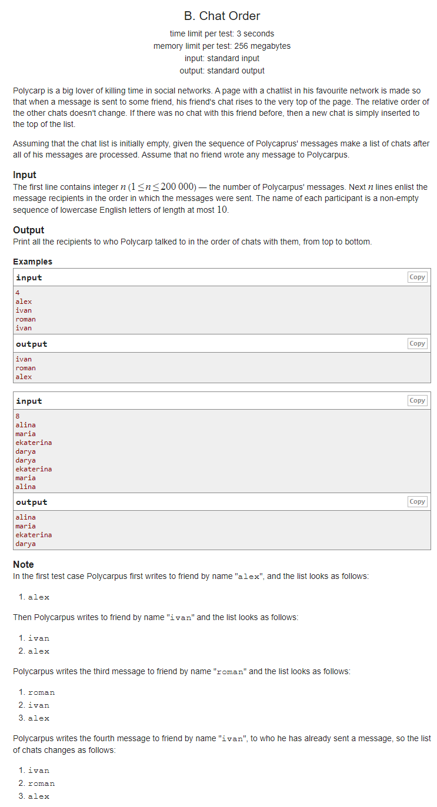
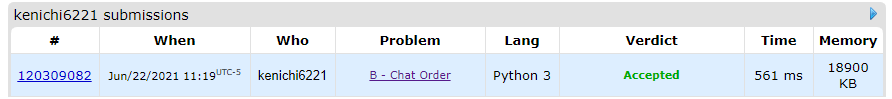

# Description:

The above image description regarded to this challege was taked from

[CodeForces: 637 B. Chat Order](https://codeforces.com/contest/637/problem/B)

## Analysis:

Here, n is small and I can notice that this behavior is a stack behavior, so last message sent will be
firs message to print, I will use an stack to store each message (worst size 200000) and after I will
use a dictionary to print only once, each name.

**Related topics**: Stack
