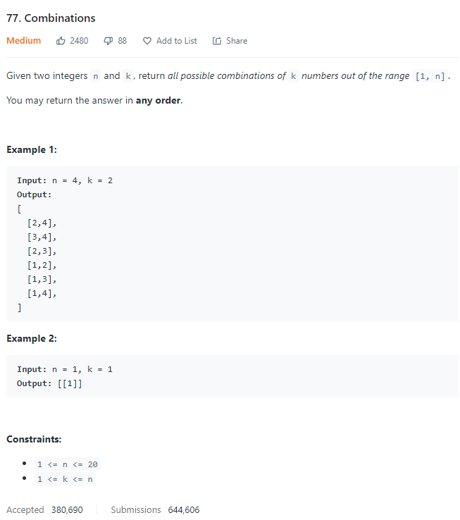
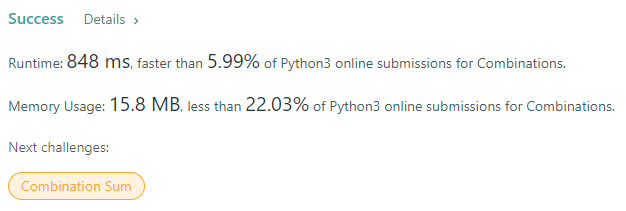

# Description:

The above image description regarded to this challege was taked from

[leetcode:77. Combinations](https://leetcode.com/problems/combinations/)

## Analysis:

Here, we can apply backtracking technique with follow elements:

- Base case: len(subset) == k or kth = n
- Process solution: if len(subset) == k, add subset to final_collection
- Candidates or options: [include_kth_element, skip_kth_element]

## Performance help:

- If k == 1 => the only subset is [[1],[2]...[n]]
- if k == n => each element is a subset by itsefl so final_collection = [1,2,3....n]

**Related topics**: Backtracking
