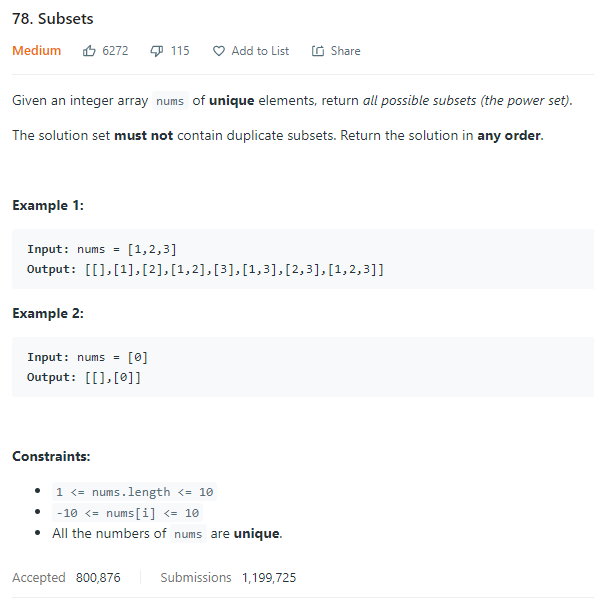
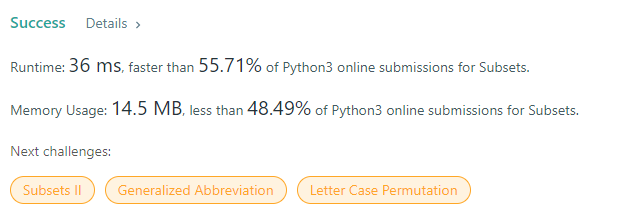
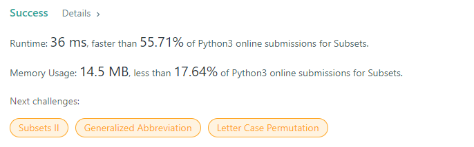

# Description:

The above image description regarded to this challege was taked from

[leetcode:78. Subsets](https://leetcode.com/problems/subsets/)

## Approach I: Backtrack

Here, I can use a backtrack solution with the next structure:

- Candidates: [include_kth_element,not_include_kth_element]
- Base case: len(subset) == len(original_array)
- Each subset (finished) will be added to the final_solution array

## Approach II: Powerset

In this case, I will apply the [Powerset](https://en.wikipedia.org/wiki/Power_set) theory to include or not the kth element inside subset.

Important to remember:

If num & (1<<kth-1) >0 : that means that kth bit is 1 in num

## Final Result

## Backtraking Approach:

## Powerset Approach

**Related topics**: Backtracking, [Powerset](https://en.wikipedia.org/wiki/Power_set)
