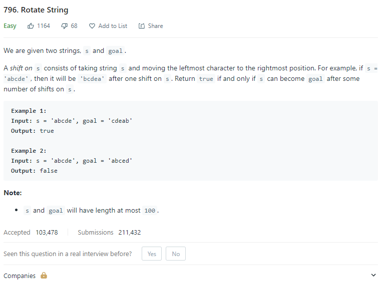
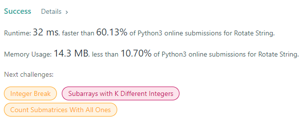

# Description:

The above image description regarded to this challege was taked from

[Leetcode: 796. Rotate String](https://leetcode.com/problems/rotate-string/)

## Analysis:

Brute force approach is just apply a rotation with the base string and check if
this rotation returns a string equal to the goal.

Cases to improve the algorithm:

- len(s)!=len(goal) => is imposible get the goal with rotations over s
- s == goal => returns true directly because we don't need any process

## Final Result

**Related topics**: Arrays, String
