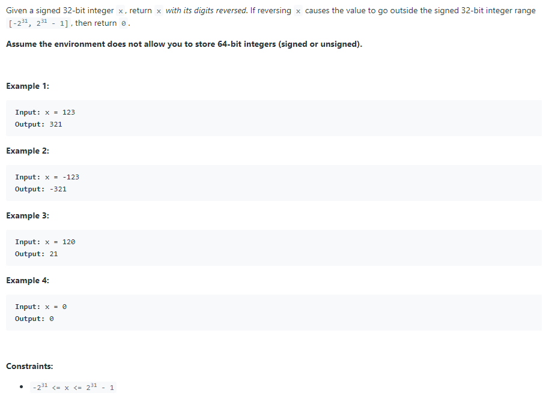
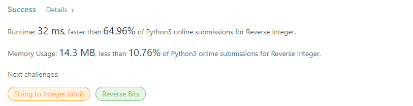

# Description:

The above image description regarded to this challege was taked from

[leetcode:7. Reverse Integer](https://leetcode.com/problems/reverse-integer/)

## Analysis:

In this case we won't change the int to string for using reverse methods, instead we will count the total digits
and we will use the follow equation:

$$
revertedNumber = (originalNumber\%10 )*10 ^d \\
where: d = math.floor(log(originalNumber))
$$

### Cornercases:

If we have a negative number then we can apply all algorithm using the absolute value instead the original number, and after we can multiply the final result to become it in a negative answer, then in this case we can
add an extra variable named factor as follow:

$$
factor = \begin{cases}
   -1 &\text{if } originalNumer<0 \\
   1 &\text{if } originalNumber>= 0
\end{cases}
$$

From above, we can use the follow equation to return the result:

$$
revertedNumber = revertedNumber * factor
$$

In addition, we will only use int numbers then if d>10 the total digits are out of int limit, then we can return 0.

Finnaly to avoid overloads or errors we can use the next conditions:

$$
revertedNumber = \begin{cases}
   0 &\text{if } factor<0 \And minInt - revertedNumber < nextDigit\\
    0 &\text{if } {factor>0} \And maxInt - revertedNumber < nextDigit\\
\end{cases}
$$

## Final Result

**Related topics**:
