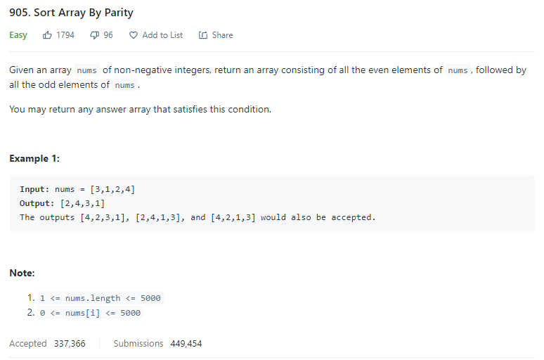
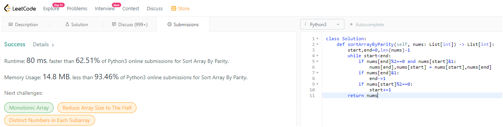

# Description:

The above image description regarded to this challege was taked from

[leetcode:905. Sort Array By Parity](https://leetcode.com/problems/sort-array-by-parity/)

## Analysis:

Here,a brute-force algorithm has O(n) time complexity, if we create two arrays (even and odd)
and forward, we use a loop to copy each number inside the related element, finally we can merge those
arrays to return the final result, so the space complexity in this case will be O(n).

A deeper analysis we can notice the following extra elements:

- The final array will have only even numbers at less until the middle - 1 position
- The final array will have only odd numbers since the middle+1 position
- Middle position will depend on the quantity of even and odd elements inside the original array

A better approach then, will consist of using a pointer form start to middle position
and other from end to middle position applying the next premisses:

- If _array[start]_ is odd and _array[end]_ swap the elements
- Start pointer only increases if _array[start]_ is even (current content is ok)
- End pointer only decreases if _aray[end]_ is odd (current content is ok)

This approach will have, O(n) in time complexity, but 0(1) in space complexity (improving the brute force approach)

### Cornercases:

- All elements are odd
- All elements are even
- len(array) == 1
- check the current position to 0 element

## Final Result

**Related topics**: Two pointers, sorting, in place sorting
