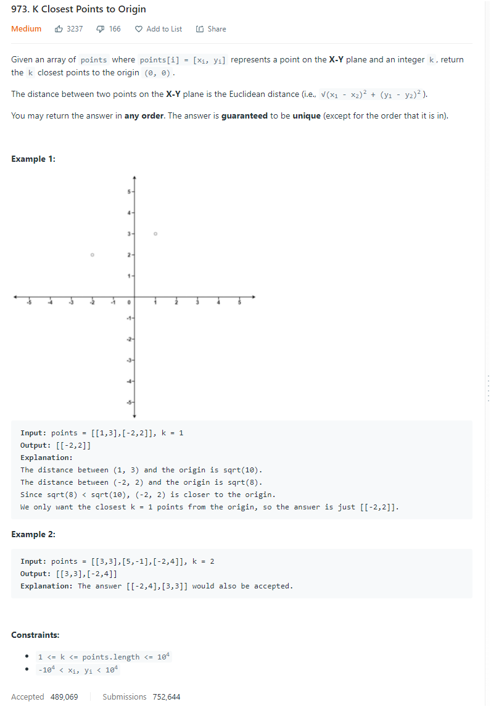

# Description:

The above image description regarded to this challege was taked from

[leetcode:973. K Closest Points to Origin](https://leetcode.com/problems/k-closest-points-to-origin/)

## Analysis:

Here, I can notice the following elements:

- Distance is an absolute value (always is positive)
- Distance between some point p (x,y) and the origin (0,0) has the next shape [(0-x)^2 + (0-y)^2]^1/2
- From the above equation, I can simplify distance to [x^2+y^2]^1/2
- This challenge requires the k closest point, so a max-heap with len(max-heap)=k is useful here

In addition, before applying the square function all numbers already are positives, so I will not apply
the square function instead, I will compare the radical number.

Steps:

- Get the radical number with the following equation: radical = x^2+y^2
- Push this element in a max-heap
- If len(max-heap)>k pop the maximum element
- At the end the max-heap will have the closest distances

Improving space use:

I can see inside the challenge description k<=len(points), so I can "recycle" the original array to return the final result, as concecuence the space
complexity O(k).

## Final Result

**Related topics**: heap, array
