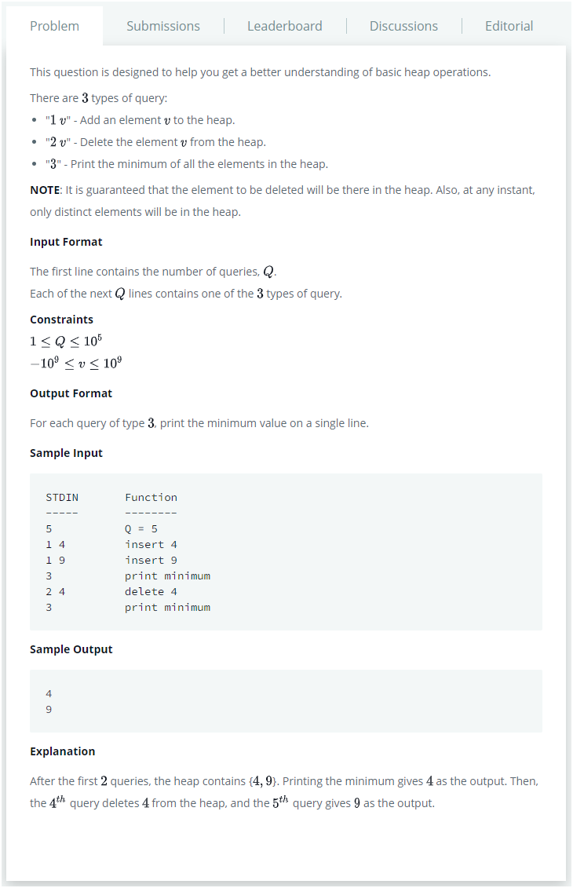

# Description:

The above image description regarded to this challege was taked from

[hackerrank: QHEAP1](https://www.hackerrank.com/challenges/qheap1/problem)

## Analysis:

Here, the big challenge is the "search to delete", a brief summary about heaps:

- Insert and delete operations have O(log n) time's complexity
- Look up minimum element has O(1) time's complexity
- Apply linear searching (because is not sorted) has O(n) time's complexity.

Mapping above knowledge to the challenge whe can notice the following things:

- Print action shows the minimun value, this acction has O(1) time complexity (no problem here).
- Insert operation has O(log n) time complexity, is a good complexity too.
- Delete an element will require O(n) time complexity because we need search, and after deleting the element.
- From challenge constrains above, the worst case contains 10^5 queries.

First, a brute force approach, is search with linear searching and after deleting each element, that works, but we will have time limit problems to complete this challenge.

Checking the required output, we can notice that print only requires the minimum value inside the correct position,
so an extra idea, is applying heapify only if delete or insert operations involves changes in minimum value, seems good
but the search complexity to delete still is O(n) :( :disappointed:

Re-viewing the heap properties, we can notice that look up complexity is O(1) only with the minimum element, so we can use
a second heap only for delete elements, and use a "lazy deletion" as follows:

- If element_to_delete == main-heap[0] we will apply pop over main heap - O(log n) where n is len(main-heap)
- If element_to_delete != main-heap[0] we will store the element_to_delete in delete-heap - O(log d) where d is len(delete-heap)
- When delete-heap[0]==main-heap[0] we will apply pop in both heaps - O(log d + log n).

## Final Result

**Related topics**: heap
