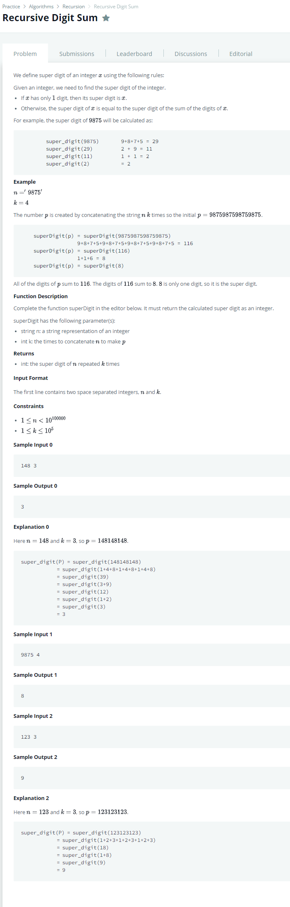
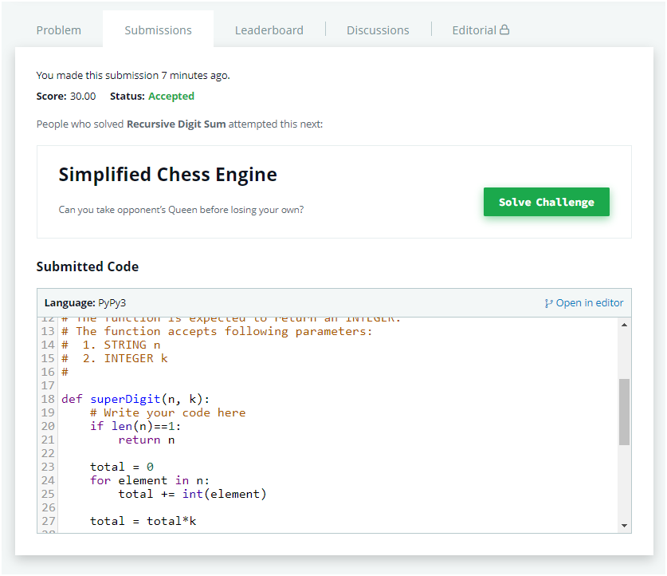
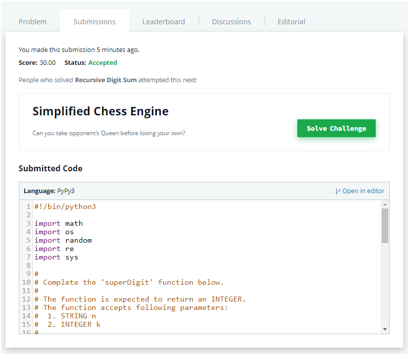

# Description:

The above image description regarded to this challege was taked from

[hackerrank:Recursive Digit Sum](https://www.hackerrank.com/challenges/recursive-digit-sum/problem)

### Recursive approach:

Here, I can notice that is not neccesary concatenate k times the n number, so I will do k_digit x k instead concatenate the original number as folow:

n = 123 k = 3

Becomes in: 123123123 => (1+2+3)+(1+2+3)+(1+2+3) => (1x3)+(2x3)+(3x3) = (1+2+3)\*3

From here, I can use the following elents to apply a recursion:

- Case base: len(n) == 1
- Process to apply: sum each digit and after multiply k times
- After first call k = 1

### Modular Math Approach:

Here, is possible apply some modular maths, so we can notice that:

10 mod 9 = 1
100 mod 9 = 1
.
.
.
10^n mod 9 = 1

In adition, we can rewrite a base 10 number as follow:

- sum(unit_kth \* 10^kth) where kth is 0 until kth position from right to left.

example:

1500 = (1 x 1000) + (5 x 100) + (0 x 10 ) + (0 x 1)

Finally we can use the following modular properties to solve this challenge:

(a+b) mod m = [(a mod m) + (b mod m)] mod m
(a*b) mod m = [(a mod m) * (b mod m)] mod m

Applying those properties in 1500 for instance, we will get the next:

(1 x 1000) mod 9 = [(1 mod 9)x(1000 mod 9)]mod 9 = 1
(5 x 100) mod 9 = [(5 mod 9)x(100 mod 9)]mod 9 = [5x1] mod 9 = 5

so: (1000+500) mod 9 = (1+5) mod 9 = 6

## K concat analysis:

Here, we can notice that a k concatenations can be re writed as
orinal number as factor of 10^kth where kth starts in 0.

Example:
8 concatenated k = 2

88 = 9x(10+1)
88 mod 9 = [(8 mod 9 ) * (2 mod 9)] mod 9 = 7

8 concatenated k = 4
8888 = 8x(1+10+100+1000)
8888 mod 9 = [(8 mod 9)* (4 mod 9)] mod 9 = 5

### Final result: recursion result

### Final result: Modular approach

**Related topics**: Modular math, recursion
