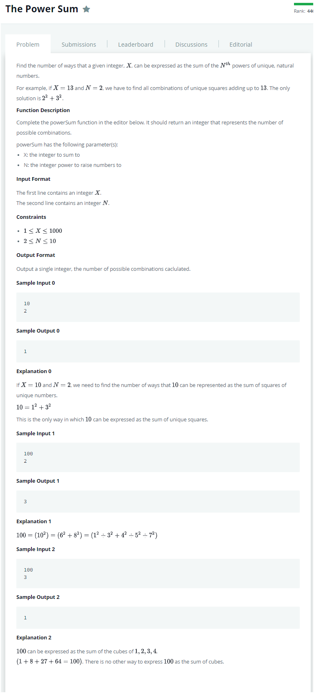
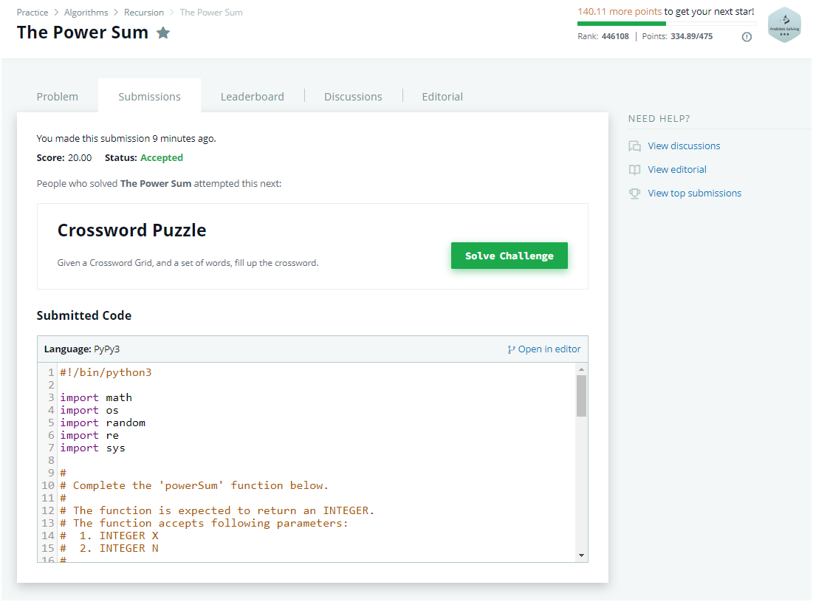

# Description:

The above image description regarded to this challege was taked from

[hackerrank:The Power Sum](https://www.hackerrank.com/challenges/the-power-sum/problem)

## Analysis:

Here, is possible apply a backtracking approach as follow:

- Precalculate all numbers where n^2<=target
- options: [include_kth_precalculate_value, skip_kth_precalculate_value]
- Base case I: sum(included_values) == target : here I will return 1 because its a solution
- Base case II: sum(included_values) > target: here is not a solution so I will return 0
- Base case III: kth == len(precalculated_values): here was not possible built a solution, so I will return 0
- Only to be an easier trace, I will add an array to trace elements added until some point, that array will be named tracer

## Final Result

**Related topics**: Backtracking, Recursion
